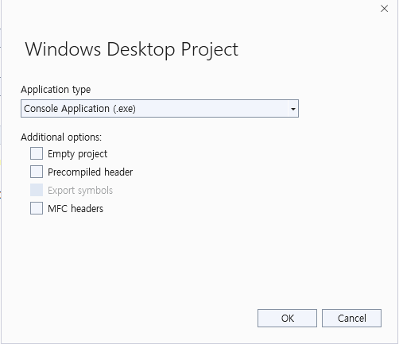
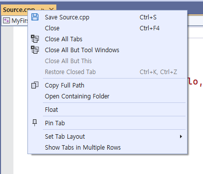
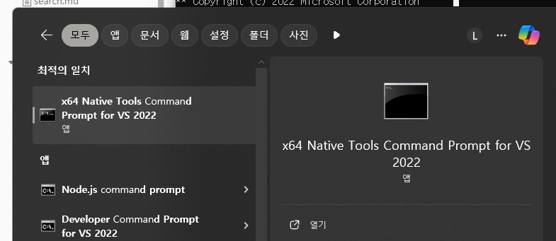
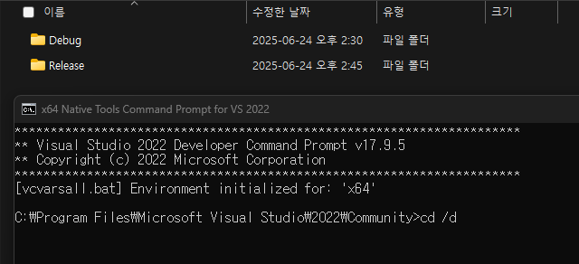
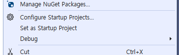

# [C++] 통합 개발 환경 (IDE) 정리

> 📘 **목표**: Visual Studio 환경에서 C++ 프로젝트를 시작하기 위한 최소한의 설정과 팁을 정리했다.  
> 초보자 기준, 실습 위주.

---

## 준비: 기본 단축키 & 자주 쓰는 기능

### 스크린샷 단축키
- `Windows + Shift + S` → 원하는 영역 캡처

---


## 프로젝트 생성하기

### Visual Studio 기본 흐름
1. `Create new project`
2. `Windows Desktop Wizard` 또는 `Console App` 선택
3. **Empty project** 생성
4. `Ctrl + Alt + L` → Solution Explorer 열기
5. `Source Files` → `Add` → `New Item` 클릭



> 🧱 **Tip**:  
> `Precompiled header` 옵션은 대형 프로젝트에서 빌드 속도를 높일 때 사용한다.


## 첫 실행: Hello World!

```cpp
#include <iostream>

int main()
{
    std::cout << "Hello World!" << std::endl;
    return 0;
}
```

> 출력문 기본형
>  `std::cout << "문자열" << std::endl;`


## 콘솔 실행 & 디버그 폴더

1. 프로젝트를 한 번 **디버깅 실행**하면 `Debug` 폴더가 생성된다.
2. `.cpp` 파일 우클릭 → `Open Containing Folder` 선택
3. `x64` → `Debug` 폴더로 이동



찾는법 : .cpp 파일 우클릭 후 Open Containing Folder 클릭-> x64 폴더 안에서 경로 확인


검색에서 해당 cmd 찾은 후 cd /d (D드라이브로 변경)



Debug 파일을 콘솔창에 드래그 앤 드롭하면 위치 복사 
dir 명령어 실행하여 파일 확인 후 실행하고싶은 .exe파일 이름 치면 실행됨

**자동완성 기능 : 파일명 첫글짜 치고 tab 키 누르면 됨. 나올때까지 계속 누르면 됨**


## Visual Studio 계층 구조 이해하기

Visual Studio는 **하나의 솔루션(.sln)** 안에 여러 프로젝트를 포함할 수 있습니다.

```
Solution
 ┣ project1
 ┗ project2
```

> 각 프로젝트의 언어가 달라도 괜찮다.
>  실행할 프로젝트는 `Set as Startup Project`로 설정



Set as Startup Project로 설정하면 실행 시 그 프로젝트가 실행된다. (**Bold체로 보임**)
