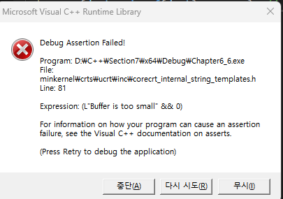

```markdown
### 💟 {{1}}. 배열 - Array 기초
- 배열의 사이즈 구하는 법은 자료형크기 * 인덱스 개수이묘
- 초기화는 각각 설정할 수 잇은, 근데 인덱스 넘어가는값 초기화하면 빌드안됨
- 넘어가는값 초기화 안하고 출력해보면 쓰레기값 나오묘
- 구조체도 배열선언 가능 -> 구조체 크기는 안에 선언된 변수들의 자료형크기 총합 
- 구조체 배열 크기 = 구조체 크가 * 인덱스 수
- 구조체 배열 접근방법 : rectangles[0].width 이런 식으로 접근한.
- 초기화 방법 4가지가 잇은. 각각 / 일부만 / c++11 이상 / 모두0
- Enum을 배열 인덱스로 쓸수도잇은 근데 권장 ㄴ So enum class로 묶어버림
- enum 으로 초기화하고 인덱스화 가능 - 장점 : 개수랑 인덱스 일치
- 배열 크기는 컴파일 타임에 고정 -> 가변변수 ㄴㄴ해 const를 넣던가 해야대
- 근데 동적할당을 쓰긴해 
### 💟 {{2}}. 배열 - Array 2
- 배열 이름 자체가 주소로 쓰이묘 
- 배열의 경우 주소연산자 & 를 사용하지 않아도 배열의 시작주소가 찍힌,
- 배열의 시작주소는 [0]주소와 같은ㅋ
- 배열 주소 10진수로 보고싶으면 꼭 (int) 캐스팅 해주시긔
- 배열 주소를 찍어보면 int형은 4바이트라 4씩 커진.
- 함수의 파라미터로 배열을 넣을 수 잇은.
- 파라미터로 전달되는건 배열 그자체가 아니라 포인터임.(주소)
- 차피 포인터로 받아와서 크기는 전달안해도된ㅋㅋ
- 쓰는 방버비 여러개가 잇은.
- 근데 파라미터로 받은 배열 & 찍어보면 뭔 다른 주소가 나오묘 -> 포인터변수의 주소임
- [0] 찌거보면 내가아는 시작주소가 나오노요
- 포인터 변수의 사이즈를 찍어보면 8이찍히노요. 배열이 아니라는 증거라노
### 💟 {{3}}. 배열과 반복문
- arrray 의 사이즈를 구하는 방법이 잇은.
- 파라미터로 넘어간 배열 사이즈는 그 방법으로 구하면 안대노요. 왜? 배열 사이즈 찎어보면 8나오니까. 사실 배열이 아니고 배열포인터 변수의 사이즈가 나오니깐ㅋ
- 파라미터로 그럼 element수까지 보내야 가능ㅋㅋ
### 💟 {{4}}. 배열과 선택 정렬
- 선택정렬이라는 알고리즘이잇은.
- swap 이란게 잇은. 인덱스만 저장해도 ㄱㅊ은거 아시는분
### 💟 {{5}}. 정적 다차원배열
- 잘 안쓰노요
- 0으로 초기화하는 방법이 잇은. 안되는 방법이 잇은.
- 이차원 배열은 내부적으로는 일차원이긴함
- 그건 주소를 찍어보면 증명이 가능하긴해
- row M / column M 가 잇은
- 세마이콜론을 꼭 찍어야하묘, 등호 없는 초기화법도 잇은 c++11
### 💟 {{6}}. 배열 문자열 - c++ 스타일
- String 이란게 잇은. <cstring> 을 씀
- char [] = "" 선언시 sizeof 찍어보면 "안의 글자수" 보다 1개가 더 많이 찍힘
- 왜? 마지막에 안보이는 \0 null char가 잇은
- cout 은 \0만날때까지 출력하는거묘.
### 💟 {{7}}. 포인터 기초 - 따로 문서로 빼야대
- 지역 변수와 동적 할당 메모리는 저장되는 주소의 위치가 다름을 유의
- 주소 출력법, 앧오프 오퍼레이터
- 포인터란게 잇은. 메모리주소를 담는 변수임
- * 의 위치논쟁이 잇은. 그냥 쓸때랑 파라미터로 넘길 때가 잇는데 스타일은 자유긴함
- 다변수 선언 시 포인터 선언 주의해야하묘
- 포인터는 변수의 타입명과 동일해야 오류가 안나노요
- 이중 삼중 포인터 사용 시 typedef사용하면 좋긴함
- de reference 라는 개념이 잇은. * 이건 dereference operator 임
- 포인터의 자료형이 왜 필요하냐면 나중에 deref할때 어떤 타입으로 가져올지.
- typeid 로 확인가능하긴한데 os마다 다르게 뜨묘
- 포인터 변수는 사이즈가 따로 정해져잇은. 불면임.
- 구조체 에도 포인터 사용가능함 -> 크기를 찍어보게나
- 문제점 초기화한하면 ㅈ댐!

### 💟 {{7_b}}. Null pointer
- 널포인터 선언 방법이 3개가 잇은.
- 널포인터가 왜중요한지 말해보시긔
- 함수의 파라미터로 포인터를 받는게 잇은. 이때 파라미터로 &주소를 넣어줘도 잘 작동함.
- nullptr_t 라는 키워드가 잇은.
- 포인터변수자체의 주소도 찍어볼수잇은. 파라미터로 들어간거의 주소도 찍어볼수잇은
- 두개가 다른 주소 사용. 왜? 복사, 다른 주소 쓴다

### 💟 {{8}}. 포인터와 정적배열
- 신기한 현상이 잇은. char배열인 문자열은 정수형 배열과 출력결과가 다름
- 배열은 곧 주소다라는 사실은 이제 잘 알거심
- 근데 char 형을 찎어보면 주소가 나오는게 아니라 그 문자열 전체가 뜸
- [0]번쨰의 주소를 찍어ㅓ도 그 문자열 전체가 나오묘
- 이건 오버로딩 기능때문임 
- ostream& operator<<(ostream& os, const char* str); 라는게 잇은
- char*을 받으면 그 포인터가 가리키는 null-terminated 문자열을 출력함
- 근데 * 로 받으면 첫번째 문자가 나옴 - 디레퍼런싱
- 그러니까 정리하자면 문자열은 오버로딩으로 인해서 주소 출력이 안됨.
- 정 하고싶으면 (void*) 로 캐스팅해야됨 ㄷㄷ
### 💟 {{9}}. 포인터 연산과 배열 인덱싱
- 포인터 앞에 타입명을 붙이는 이유 2가지가 있은.
- uintptr_t 라는 타입이 잇은. 
- 문자열 길이 계산법이 잇은. 바로 배열사이즈오브 / [0] 사이즈오브인
- 문자열 출력은 굉장히 희안한 규칙이잇은. 오버로딩이 잇어서 문자열을 출력하면 그 인덱스만 나오는게 아니라 그 인덱스부터 '\0'까지 다나옴 ㄷㄷ
- 포인터로 찍는 방법도 잇은
### 💟 {{10}}. C언어 스타일의 문자열 심볼릭 상수
- 문자열은 리터럴이라 포인터에 넣을 수 없은.
- 근데 const로 선언하면 문자열 리터럴을 가리킬 수 잇은
- 함수로 리터럴을 받아올때 함수의 리턴값또한 const여야 하묘
- 놀랍게도 주소가 같음 왜?같은값이니카. 만약 다른값이엿음 다른주소 찍힘
- 그냥 char에 문자 넣고 주소찍으면 왜 괴이한 현상이?
### 💟 {{11}}. 메모리 동적 할당 new 와 delete
- memory leak 이라는게 잇은ㅋㅋ 파악할 수 있는 방법이 2가지가 있은
- 사실 new delete는 속도가 느림. 
- 정적으로 할당하는 메모리는 스택에 들어감. 스택은 용량이 적슨
- 동적할당 문법을 써보시긔
- OS로 부터 받아온 메모리의 주소에 포인터를 저장하는 로직이긔
- 다른 프로세스가 메모리를 다써버려서 할당 ㄴㄴ 인경우가 있긔.
- 그럴땐 nothrow 키워드 사용. 
- 선언 시 * 랑 de referencing 시 * 는 다르닷!!!
- 다쓴 후 돌려줘야댐 ;;
- null ptr 를 de referencing하면 오류가 나버림ㅋㅋ
- 그래서 전 강의에서 배웠던 nullptr을 써야함. if nullptr 체크 필수
### 💟 {{12}}. 동적 할당 배열
- c에서는 정적배열 할당 시 const가 아닌 int 선언 불가 ㅋㅋ
- 초기화 방법도 잇은. 0으로 초기화->()or {}
- 초기화방법이 또잇은. 이방법은 [크기] 보다 원소개수가 작으면 오류소리가 남
- 근데 크기 지정은 ㅈㄴ 필수긔.int * array2 = new int[]; 이런거 안됨 ;;
- 동적 배열은 크기가 런타임에 결정되는데 코드에서 미리 값을 변경하면 초록줄이 뜸 왜?컴파일타임엔 결정된게 없으니깐ㅋㅋ
- 동적할당배열도 당여니 delete [] 해야하긔 
- 포인터 + new = 동적 할당이다
### 💟 {{13}}. 포인터와 const
- 5가지 case가 잇은
- 1.변수가 const 인 경우 : 포인터도 const int * 사용해야 & 를 넣을 수잇은
- 당여니 de referencing 을 해서 값을 바꾸는건 안됨ㅋㅋ const 니까
- 놀랍게도 포인터의 주소 교체는 가능함 ㅋㅋ 포인터변수 자체는 const가 아니니깐ㅋ
- de referencing 해서 값 읽기는 당여니 가능
- 2. 포인터만 const 인 경우 : 당여니 de referencing 해서 값을 바꾸는건 안댐. 
- 근데 바꾼 값을 읽는건 또 됨 ㄷㄷ
- 3. 2번case 에서 주소 교체 -> 당연니 됨. 1번 케이스를 보시라
- 4. 포인터변수 자체가 const : 포인터의 주소값 못바꿈
- 근데 dereferencing 가능ㅋㅋ
- 5. 포인터도 const고 포인터자체변수도 const : dereferencing도 안되고 주소도 못바꾸미 ㅋ
### 💟 {{14}}. 참조 변수
- & 는 두가지 의미를 가지노요. 변수 초기화 &이 있고 값 앞 &이 잇은
- 참조는 alias임 그래서 주소도 원래 변수랑 같은ㅋㅋ
- 참조는 반드시 초기화 필요하고 리터럴로 초기화도 안되노요
- const int는 참조도 const int&로 해야됨요
- alias 는 둘중 아무거나 재할당하면 둘다 반영이긔
- 함수 파라미터로 &를 넘길 수 잇은ㅋㅋ포인터보다 조흔 점이 잇은.
- 배열을 참조로 받을 수 잇은 근데 이때 element 수가 필수이긔윤
- structure 에서 참조가 유용하긔. 왜? 접근경로가 길 수도 있은
### 💟 {{15}}. 참조와 const
- 참조는 리터럴 안된다고 위에서 배웟은
- 근데 const면 리터럴이 됨 엥!!!주소는 컴파일러가 알아서 관리
### 💟 {{16}}. 포인터와 참조의 맴버 선택 연산자 
- 구조체를 만들엇은 접근하고십은. 
- 구조체를 포인터로 받아올수도, 참조로 받아올수도 잇은.
- 전자는 접근하고 싶으면 -> 를 쓰거나 ( * ptr). 이런식으로 디레퍼런싱 후 ㄱㄴ
- 후잔 그냥 mso 쓰면 됨
### 💟 {{17}}. For each 반복문
- auto 랑 많이 쓰림.
- for each 에서도 마찬가지로 값을 바꾸고싶니? reference로 받아와라
- vector 가 아닌 일반 포인터 배열은 for each 안됨ㅋ
- auto& 를 알아두시긔, const auto 도 알아두시기
- for each 와 max 함수 조합 익혀두기 std::max(max_number, number)
### 💟 {{18}}. void 포인터
- 원래 포인터랑 넣으려는 변수 자료형 같아야 오류 안남. 근데 void 는 암고나 넣어도 ㅇ
- 그래서 포인터 연산이 안됨ㅋㅋ
- 근데 주소는 있는데 dereferencing 은 안됨
- 할 수 있는 방법이 잇은ㅋ static casting한 거에서 다시 de reference하면됨
- 최근에는 일케 까지 않하긴헤
### 💟 {{19}}. 이중 포인터와 동적 다차원 배열
- 이중포인터 설명해보시긔
- 이차원배열을 그냥 정적으로 구현할 수 있은.
- 이차원 배열을 노가다로 동적배열할당할수잇은. delete 필수고 순서 중요함
- 근데 for문으로 좀 빨리 만들고싶은. 그럼 이중포인터를 쓸 수 잇은.
- 이정표 - col 삽입 - 초기화 - delete 과정을 코드로 짜보시긔
- 더쉬운방법이 잇은. 그건 단일포인터를 쓰는것인.
- 코드를 짜보시게나
### 💟 {{20}}. std::array 소개 -> 정적 배열 대체
- 
### 💟 {{15}}. 참조와 const
```


